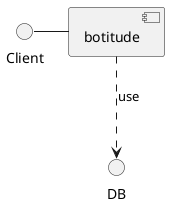

# botitude

Here is technical documentation of the `botitude` service.

## Functionalities

*Legend:* ✅ Fully supported ❌ Not supported 〰️ Partially supported

| Item | Supported | Standards |
|------|:---------:|-----------|
| **Add** | | _N/A_ |
| Some | ✅ | _N/A_ |
| **Functionalities** | | _N/A_ |
| For | ✅ | _N/A_ |
| **Your** | | _N/A_ |
| Service | ✅ | _N/A_ |

## Architecture Diagram

Find below architecture diagram:

You can also use diagram from the link:

[Architecture Diagram](architecture.puml.md)
